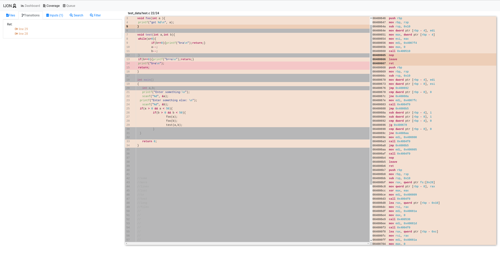

# fuzz_ui

Experimental prototype of the the fuzzing UI shown here: (https://www.youtube.com/watch?v=Wy7qY5ms3qY&t=1974s)

NOTE: THIS IS A DUMP OF OLD, BROKEN AND __INSECURE__ CODE. THE WEBSERVER WILL __RUN ARBITRARY COMMANDS__ & RETURN ARBITRARY
FILES BY DESIGN. 

FOR THE LOVE OF GOD, DO NOT RUN THIS ON ANY MACHINE THAT YOU CARE ABOUT. 

